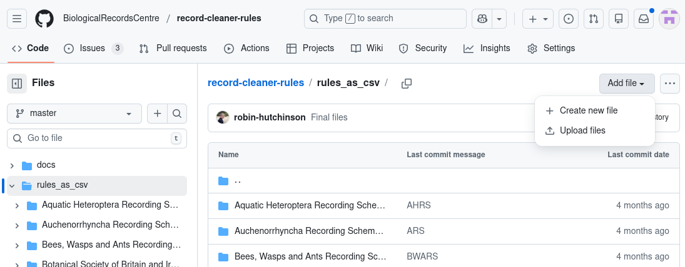
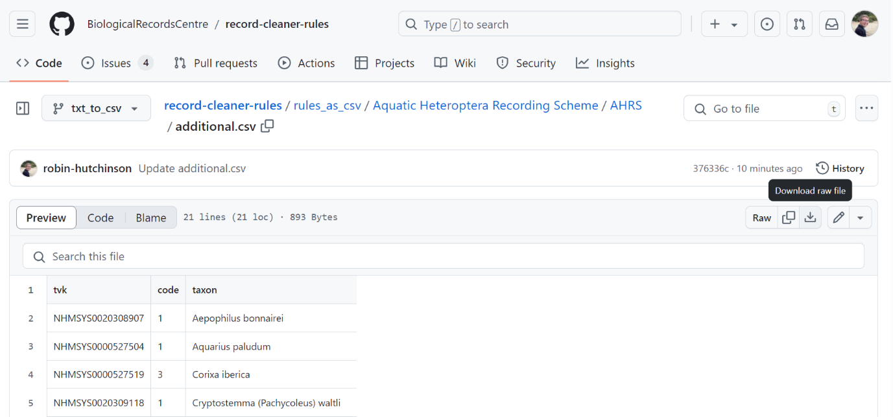
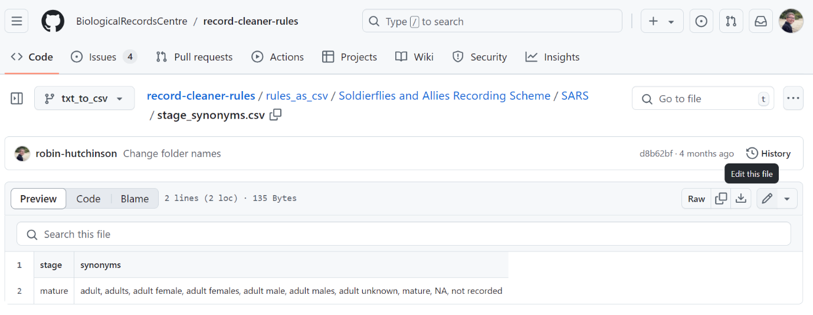
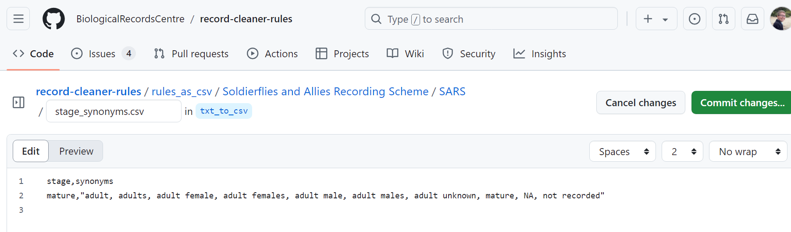

# Editing Rules on Github

The Github website provides one way to add and modify rule files. 

Before you can start you must first [create a GitHub
account](https://github.com/signup?ref_cta=Sign+up&ref_loc=header+logged+out&ref_page=%2F&source=header-home). 

You can make your own copy of our rules, known as a fork, which you can modify
and then request to be used to update our copy. You can invite your colleagues
to collaborate with you on your fork. Github provides useful tools for reviewing
changes and discussing them before accepting them so that the process can be 
carefully managed.

The screenshots below are taken from our copy of the rules but you would
perform these actions in your fork.

## Adding a rule set 

Navigate to the rules_as_csv folder. 

Click “Add file” in the top right hand corner, then click Upload files:  

Drag and drop your recording scheme folder into the box. 

Add a description of the files you are uploading to the text box labelled “Add
an optional extended description” 

Click “Commit changes”. 

If you would like to add a rule set to an existing recording scheme folder,
navigate to the recording scheme folder before clicking upload files, then drag
and drop the rule set folder. 

To add a new rule type to an existing rule set, click upload from the rule set
folder, and then drag and drop the files you would like to add. 

## Editing a file

The first option for editing a rule set is to download each file you would like
to change. To download a file, navigate to the file, then type 
`Control + Shift + S`. Alternatively, click the downwards arrow: 

Edit the csv files on your computer, and then re-upload the corrected files (following the same procedure as above). GitHub will automatically replace any updated files. 

You can also edit a file in place by clicking the pen symbol in the upper right hand corner (or type the letter “e” as a shortcut): 

In these files, columns are separated by commas. If you are adding text that has a comma, include quotation marks to enclose the text within the column: 

